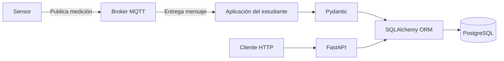

# Guía de Trabajo Práctico Experimental — Taller 2

**API para adquisición, validación y consulta de datos IoT con FastAPI, MQTT y PostgreSQL**

---

| Campo | Valor |
|---|---|
| **Código de guía** | 002 |
| **Laboratorio** | Laboratorio DevOps |
| **Tiempo de trabajo práctico estimado** | 4 días |
| **Asignatura** | Aplicaciones y Servicios Web |
| **Programa académico** | Tecnología en Desarrollo de Software |
| **Elaborado por** | Juan Carlos Morales Guerra |
| **Revisado por** | Juan Carlos Morales Guerra |
| **Versión** | 001 |
| **Fecha** | 07-10-2026 |

---

## 1. Competencias, Contenido Temático e Indicador de Logro

| Competencias | Contenido Temático | Indicador de Logro |
|---|---|---|
| Diseñar e implementar una API para recibir, validar, almacenar y consultar datos provenientes de un sensor IoT, aplicando separación de responsabilidades y persistencia en PostgreSQL. | FastAPI. Pydantic. SQLAlchemy ORM. PostgreSQL. CRUD. Claves primarias y foráneas. Endpoints HTTP. Códigos de respuesta HTTP. MQTT. Validación de payloads. Consultas por identificador, magnitud y rango de fecha. Git y GitHub. | El estudiante integra un consumidor MQTT con una API desarrollada en FastAPI, valida los datos recibidos, consulta la configuración del sensor mediante ORM, almacena las mediciones válidas en PostgreSQL y expone endpoints de consulta con manejo adecuado de errores. |

---

## 2. Fundamento Teórico

Una **API REST** permite que aplicaciones diferentes intercambien información mediante solicitudes HTTP. En este taller, FastAPI se utilizará para exponer endpoints que permitan consultar sensores, magnitudes y mediciones almacenadas.

**FastAPI** es un framework de Python orientado al desarrollo de APIs. Permite definir rutas, parámetros, respuestas HTTP y modelos de validación. También genera documentación automática mediante OpenAPI.

**Pydantic** permite definir la estructura esperada de los datos y validar campos obligatorios, tipos de datos y formatos. En esta práctica se utilizará para validar el contenido de los mensajes recibidos y los datos utilizados por la API.

**SQLAlchemy ORM** permite representar tablas de PostgreSQL mediante clases de Python. El ORM se utilizará para consultar los sensores y sus magnitudes, trabajar con claves primarias y foráneas y almacenar las mediciones válidas.

**CRUD** corresponde a las operaciones Create, Read, Update y Delete. La existencia de una capa `crud/` no implica que todas las entidades deban implementar las cuatro operaciones. Cada módulo deberá implementar únicamente las operaciones autorizadas para esa entidad.

### MQTT

**MQTT (Message Queuing Telemetry Transport)** es un protocolo de mensajería ligero utilizado frecuentemente en sistemas IoT. Su funcionamiento se basa en un modelo de publicación y suscripción.

Los elementos principales son:

- **Publicador:** dispositivo o aplicación que envía mensajes.
- **Broker:** servicio que recibe los mensajes y los distribuye.
- **Suscriptor:** aplicación que recibe los mensajes de uno o varios tópicos.
- **Tópico:** ruta utilizada para organizar los mensajes.

En esta práctica, el sensor publica mediciones en un tópico MQTT y la aplicación desarrollada por el estudiante actúa como suscriptor.



---

## 3. Objetivos

### Objetivo General

Desarrollar una aplicación backend que reciba datos IoT mediante MQTT, valide la información con Pydantic, consulte la configuración del sensor mediante SQLAlchemy ORM, almacene las mediciones válidas en PostgreSQL y permita consultarlas mediante endpoints desarrollados con FastAPI.

### Objetivos Específicos

- Consumir datos desde un tópico MQTT asignado.
- Interpretar el modelo de datos suministrado.
- Implementar modelos SQLAlchemy ORM.
- Implementar esquemas Pydantic.
- Validar estructura, tipos de datos y timestamp.
- Validar sensor, magnitud, unidad y rango mediante ORM y lógica de negocio.
- Almacenar mediciones válidas en PostgreSQL.
- Implementar consultas por ID, magnitud, histórico y rango de fechas.
- Manejar respuestas y errores HTTP.
- Organizar el código mediante separación de responsabilidades.
- Documentar y evidenciar el funcionamiento en GitHub.

---

## 4. Recursos Requeridos

### Equipos

- Computador personal o estación de trabajo por estudiante.

### Herramientas de Software

- Python 3.10 o superior.
- FastAPI.
- PostgreSQL.
- SQLAlchemy.
- Pydantic.
- Uvicorn.
- Cliente MQTT para Python.
- Git.
- Cuenta en GitHub.
- Editor de código.

### Infraestructura suministrada

**Broker MQTT**

```text
emqx.coriotlab.co
```

La estructura general de los tópicos será:

```text
iot/sensors/{sensor_id}/data
```

Ejemplo:

```text
iot/sensors/TEST-001/data
```

El tópico real será suministrado por el docente.

**Base de datos PostgreSQL**

El host, las credenciales y el nombre de la base serán suministrados por el docente.

### Recursos disponibles en el repositorio

El repositorio del taller contiene:

- `data-model.md`: descripción de tablas, campos, tipos de datos, claves y relaciones.
- `mqtt_example.py` : ejemplo para conectarse al broker, suscribirse a un tópico y visualizar mensajes MQTT.

El script de ejemplo es una guía de consumo MQTT se debe cambiar el topico por el asignado para cada grupo.

### Asignación de sensores

Cada grupo recibirá un sensor asignado por el docente.

La asignación podrá realizarse hasta:

**viernes 9 de octubre de 2026**

Después de esta fecha no se asignarán sensores.

El identificador entregado corresponde al campo `codigo` de la tabla `sensores`.

---

## 5. Aspectos de Seguridad

La práctica corresponde a una actividad de desarrollo de software y no implica riesgos físicos o químicos asociados al uso de equipos experimentales.

Se deben tener en cuenta las siguientes consideraciones:

- No incluir credenciales reales en el código fuente.
- No subir archivos `.env` al repositorio.
- Utilizar variables de entorno para credenciales y parámetros de conexión.
- Mantener `.env` dentro del `.gitignore`.
- Realizar copias de seguridad mediante commits frecuentes.
- No modificar datos de otros grupos.
- Utilizar únicamente el sensor y tópico asignados.

---

## 6. Procedimiento o Metodología para el Desarrollo

La práctica se desarrollará en equipos de trabajo de maximo dos personas, no se permiten equipos de tres si excepción.

### Actividad 1: Configuración Inicial del Proyecto

1. Crear el branch taller-2 en el repositorio en GitHub del curso.
2. Crear y activar un entorno virtual.
3. Instalar las dependencias.
4. Crear `requirements.txt`.
5. Crear `.gitignore`.
6. Configurar las variables de entorno necesarias.
7. Verificar la conexión con PostgreSQL.
8. Ejecutar el script MQTT de ejemplo y comprobar la recepción de mensajes del sensor asignado.

---

### Actividad 2: Comprensión del Problema y del Modelo de Datos

#### A. Planteamiento del Problema

Una infraestructura IoT dispone de sensores destinados al monitoreo de variables relacionadas con calidad del aire, calidad del agua, gases y condiciones ambientales.

Cada sensor puede medir una o varias magnitudes y publica periódicamente sus datos mediante el protocolo UDP MQTT.

La aplicación desarrollada debe:

1. conectarse al broker MQTT;
2. suscribirse al tópico del sensor asignado;
3. recibir y decodificar los mensajes;
4. validar la estructura y los tipos de datos;
5. consultar la configuración almacenada en PostgreSQL;
6. validar sensor, magnitud, unidad y rango;
7. almacenar únicamente mensajes válidos;
8. exponer endpoints de consulta mediante FastAPI.

#### B. Payload

Los sensores publican mensajes JSON.

Ejemplo:

```json
{
  "sensor_id": "TEST-001",
  "timestamp": "2026-10-07T16:25:30Z",
  "measurements": {
    "temperature": {
      "value": 24.6,
      "unit": "C"
    }
  }
}
```

El campo `sensor_id` recibido mediante MQTT corresponde al campo `codigo` de la tabla `sensores`; no corresponde a la clave primaria numérica `id` en la base de datos.

Cada grupo deberá revisar el payload real recibido y documentar:

- magnitudes;
- unidades;
- tipos de datos;
- estructura;
- timestamp.

#### C. Modelo de Datos

El modelo de datos se encuentra en:

```text
data-model.md
```

Los estudiantes deberán interpretarlo y construir los modelos ORM correspondientes.

El catálogo de sensores y magnitudes ya existe en la base de datos y es suministrado por el docente.

La aplicación puede consultar este catálogo, pero no crear, modificar ni eliminar sensores o magnitudes.

---

### Actividad 3: Implementación de Modelos, Schemas y CRUD

La solución deberá separar responsabilidades.

Estructura mínima:

```text
app/
├── main.py
├── schemas/
│   ├── sensor.py
│   ├── sensor_magnitud.py
│   └── medicion.py
├── models/
│   ├── sensor.py
│   ├── sensor_magnitud.py
│   └── medicion.py
├── crud/
│   ├── sensor.py
│   ├── sensor_magnitud.py
│   └── medicion.py
├── api/
│   ├── sensor.py
│   ├── sensor_magnitud.py
│   └── medicion.py
├── mqtt/
│   └── client.py
└── database/
    └── connection.py
```

Cada tabla debe tener su archivo correspondiente en:

- `schemas/`
- `models/`
- `crud/`
- `api/`

#### Validaciones con Pydantic

Pydantic deberá verificar:

- estructura del mensaje;
- campos obligatorios;
- tipos de datos;
- formato del timestamp.

#### Validaciones con ORM y lógica de negocio

Después de la validación de estructura, la aplicación deberá verificar:

- existencia del sensor;
- estado del sensor;
- relación entre sensor y magnitud;
- correspondencia de la unidad;
- consistencia de las claves foráneas.

Si un payload contiene varias magnitudes, **solo se almacenará si todas son válidas**.

Cada magnitud contenida en un payload válido debe almacenarse como un registro independiente en la tabla `mediciones`.

Todas las mediciones generadas a partir del mismo payload deben conservar el mismo `timestamp_utc`.

---

### Actividad 4: Integración MQTT y Almacenamiento

La aplicación deberá consumir los mensajes del tópico asignado.

El servicio MQTT puede publicar mensajes válidos e inválidos de forma intencional. La aplicación debe procesar ambos casos y almacenar únicamente los mensajes que superen todas las validaciones.

El timestamp recibido desde MQTT se encuentra en UTC.

La aplicación deberá:

1. validar el timestamp;
2. almacenarlo conservando la referencia UTC;
3. convertirlo en las respuestas GET a hora local de Colombia;
4. presentar la fecha y hora en un formato legible y consistente.

Cada grupo deberá recolectar datos del sensor asignado durante al menos:

```text
20 minutos
```

---

### Actividad 5: Desarrollo de Endpoints

La API debe ofrecer como mínimo operaciones equivalentes a:

```text
GET /sensores
GET /sensores/{id}
GET /sensores/por-codigo/{codigo}

GET /sensores/{id}/magnitudes
GET /sensor-magnitudes/{id}

GET /mediciones/{id}
GET /sensores/{id}/mediciones
GET /sensores/{id}/ultima-medicion
```

La consulta histórica debe permitir combinar filtros.

Ejemplos:

```text
GET /sensores/{id}/mediciones?desde=...&hasta=...

GET /sensores/{id}/mediciones?magnitud=temperature

GET /sensores/{id}/mediciones?limit=10

GET /sensores/{id}/mediciones?magnitud=temperature&desde=...&hasta=...&limit=10
```

El parámetro `limit` permite consultar las últimas N mediciones.

---

### Actividad 6: Pruebas y Evidencias

Los códigos HTTP se evaluarán únicamente en las solicitudes realizadas a los endpoints FastAPI.

Los errores detectados durante el procesamiento MQTT se deberán manejar internamente y evidenciar mediante registros de ejecución y comprobación de que los datos inválidos no fueron almacenados.

Se deberán demostrar los siguientes códigos HTTP:

```text
200
400
404
422
```

#### Evidencias obligatorias

| # | Prueba | Evidencia esperada |
|---|---|---|
| 1 | Recepción MQTT | Mensaje recibido desde el tópico asignado |
| 2 | Medición válida | Registro almacenado en PostgreSQL |
| 3 | Sensor inexistente | Mensaje rechazado |
| 4 | Unidad incorrecta | Mensaje rechazado |
| 5 | Tipo de dato incorrecto | Mensaje rechazado |
| 6 | Magnitud incorrecta | Mensaje rechazado |
| 7 | Timestamp inválido | Mensaje rechazado |
| 8 | Consulta por ID existente | Respuesta correcta |
| 9 | Consulta por ID inexistente | `404` |
| 10 | Consulta histórica | Datos históricos retornados |
| 11 | Consulta por rango de fechas | Datos filtrados |
| 12 | Rango `desde > hasta` | `400` |
| 13 | Validación HTTP incorrecta | `422` |
| 14 | Última medición | Registro más reciente |
| 15 | Últimas N mediciones | Uso correcto de `limit` |
| 16 | Filtro por magnitud | Resultado filtrado |
| 17 | Claves foráneas | Relación implementada correctamente |
| 18 | Separación de responsabilidades | Organización correcta del código |

Para cada prueba se deberá indicar:

- datos de entrada;
- resultado obtenido;
- código HTTP cuando aplique;
- registro almacenado o rechazado;
- archivo y función donde se implementa la lógica relacionada;
- breve explicación.

No es necesario incluir capturas del código fuente.

---

### Actividad 7: Trabajo Colaborativo

El equipo deberá evidenciar el trabajo colaborativo mediante Git y GitHub.

Requisitos mínimos:

- Cada integrante debe tener commits identificables.
- Los mensajes de commit deben ser descriptivos.
- El historial debe evidenciar participación del equipo.
- El README debe indicar el aporte de cada integrante.

---

## 7. Resultado Esperado del Taller

Al finalizar el taller, cada equipo deberá disponer de una aplicación funcional que:

- consuma datos desde MQTT;
- valide mensajes mediante Pydantic;
- consulte sensores y magnitudes mediante ORM;
- valide unidades y rangos;
- almacene únicamente mediciones válidas;
- conserve las relaciones mediante claves foráneas;
- exponga endpoints con FastAPI;
- permita consultas históricas;
- permita filtrar por magnitud y fechas;
- permita consultar la última medición y las últimas N;
- convierta el timestamp UTC a hora local de Colombia en los GET;
- maneje correctamente errores HTTP;
- mantenga una estructura modular del código.

Toda la solución y sus evidencias deberán quedar disponibles en el repositorio GitHub del equipo.

---

## 8. Parámetros para Elaboración del Informe

El informe del taller deberá presentarse en formato **README.md** dentro del repositorio del proyecto.

No se aceptarán informes externos en Word o PDF.

### Contenido del README.md

#### 1. Información General

- Nombre del proyecto.
- Integrantes.
- Asignatura.
- Fecha.
- Sensor asignado.
- Tópico MQTT utilizado.

#### 2. Descripción del Sistema

- Problema resuelto.
- Arquitectura implementada.
- Magnitudes y unidades recibidas.
- Payload real del sensor.

#### 3. Configuración del Entorno

- Creación del entorno virtual.
- Instalación de dependencias.
- Uso de `requirements.txt`.
- Variables de entorno requeridas, sin valores sensibles.

#### 4. Base de Datos

- Descripción de la conexión.
- Tablas utilizadas.
- Relaciones implementadas.
- Correspondencia con `data-model.md`.

#### 5. Organización del Código

Describir la función de:

- `schemas/`
- `models/`
- `crud/`
- `api/`
- `mqtt/`
- `database/`

#### 6. Endpoints Implementados

Tabla con:

| Método | Ruta | Descripción |
|---|---|---|

#### 7. Evidencias de Funcionamiento

Crear dentro del repositorio una carpeta:

```text
evidencias/
```

Las evidencias deberán cubrir las pruebas obligatorias de la Actividad 6.

Para cada evidencia se debe indicar el archivo y la función relacionados con la implementación.

#### 8. Control de Versiones

- Enlace al repositorio.
- Evidencia de commits.
- Aporte de cada integrante.

#### 9. Conclusiones

- Principales aprendizajes.
- Dificultades encontradas.
- Soluciones aplicadas.

### Requisitos del Repositorio

El repositorio debe:

- contener el código fuente completo;
- incluir `README.md`;
- incluir `requirements.txt`;
- incluir `.gitignore`;
- incluir `data-model.md`;
- contener las evidencias;
- no incluir `.env` con credenciales reales.

---

## 9. Disposición de Residuos

La actividad descrita en esta guía no genera residuos físicos o químicos. En consecuencia, no se requiere un procedimiento específico de disposición de residuos.

---

## 10. Bibliografía

- FastAPI. *FastAPI Documentation*. https://fastapi.tiangolo.com
- Pydantic. *Pydantic Documentation*. https://docs.pydantic.dev
- SQLAlchemy. *SQLAlchemy Documentation*. https://docs.sqlalchemy.org
- PostgreSQL Global Development Group. *PostgreSQL Documentation*. https://www.postgresql.org/docs/
- OASIS. *MQTT Version 5.0*. https://docs.oasis-open.org/mqtt/mqtt/v5.0/mqtt-v5.0.html
- Python Software Foundation. *Python Documentation*. https://docs.python.org
- Chacon, S., & Straub, B. (2014). *Pro Git*. Apress.
