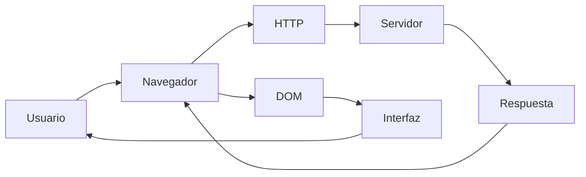
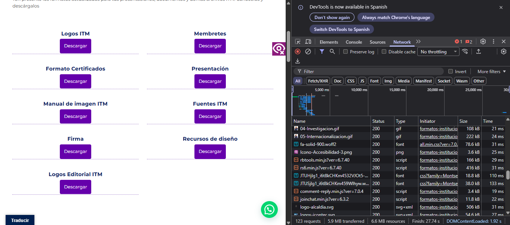
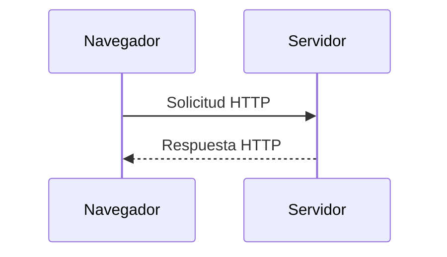
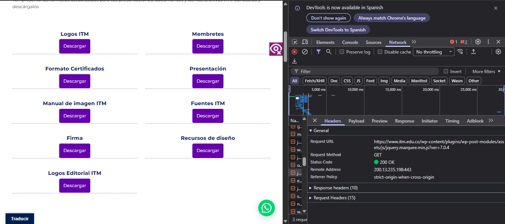
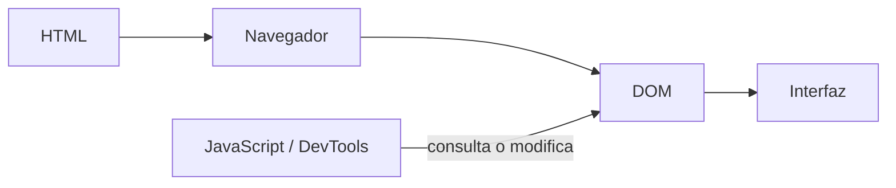
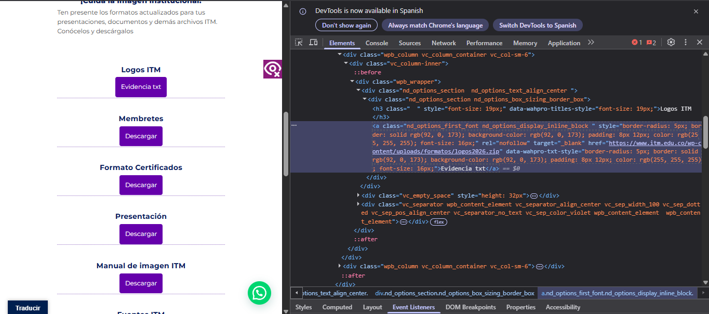
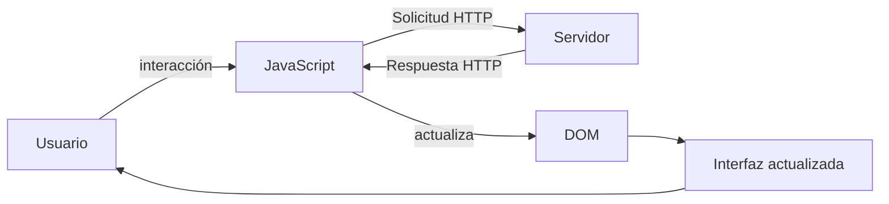
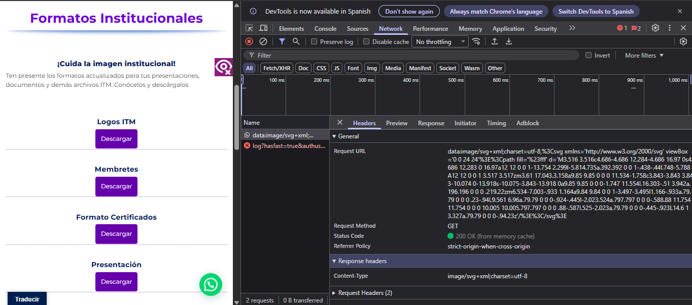
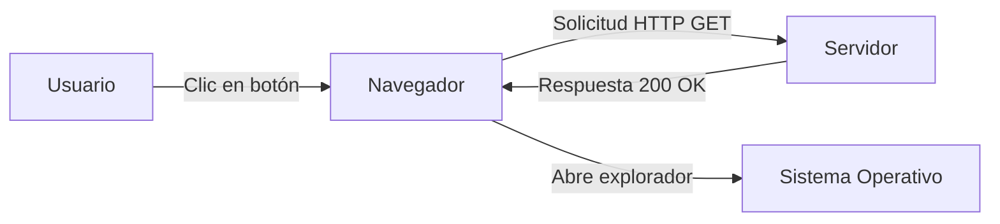

# Laboratorio 01 --- Análisis del funcionamiento de una aplicación web

> **Curso:** Aplicaciones y Servicios Web\
> **Modalidad:** Práctica de laboratorio\
> **Entrega:** Repositorio GitHub --- archivo `README.md`\
> **Evidencias:** Carpeta `evidencias/`

------------------------------------------------------------------------

## Objetivo de la práctica

Analizar el funcionamiento de una aplicación web real mediante las
herramientas de desarrollo del navegador, identificando los recursos
cargados, las solicitudes y respuestas HTTP, la estructura DOM y las
interacciones entre cliente y servidor.

## Resultado esperado

Al finalizar la práctica, el estudiante deberá poder reconstruir y
documentar el flujo observado entre:



> El diagrama anterior representa los **componentes que serán
> analizados**. El diagrama final de la práctica deberá ser construido
> por el estudiante a partir de sus propias observaciones.

------------------------------------------------------------------------

# 1. Preparación del entorno

1.  Ingrese a la aplicación web indicada por el docente.
2.  Abra las **herramientas de desarrollo** del navegador.
3.  Identifique las herramientas **Red / Network** y **Elementos /
    Elements**.
4.  Cree la siguiente estructura dentro del repositorio:

``` text
laboratorio-01/
├── README.md
└── evidencias/
```

El archivo `README.md` será el informe de la práctica. La carpeta
`evidencias/` contendrá las capturas utilizadas para sustentar los
resultados.

------------------------------------------------------------------------

# 2. Identificación de recursos de la aplicación

Abra la herramienta **Red / Network** y recargue completamente la
aplicación.

Observe las solicitudes generadas durante la carga e identifique como
mínimo **cinco recursos**, procurando seleccionar tipos diferentes:
documento HTML, CSS, JavaScript, imágenes, fuentes u otros.

## Resultados

Complete la tabla:

  Recurso   Tipo   Dominio     Tamaño
  --------- ------ --------- --------
04-Investigacion.gif | gif | www.itm.edu.co | 108kb                                 
rbtools.min.js?ver=6.7.40 | js | www.itm.edu.co | 166kb                               
Icono-Accesibilidad-3.png | png | www.itm.edu.co | 3.6kb                               
fa-solid-900.woff2 | font | www.itm.edu.co | 78.6kb                                  
joinchat.min.js?ver=6.3.2 | js | www.itm.edu.co | 11.8kb                                                 
                             
                             
                             
                             

**Total de solicitudes observadas:** `__5___`

## Evidencia

Guarde una captura de la pestaña Network como:

``` text
evidencias/network.png
```

Inclúyala aquí:

``` markdown

```

### Análisis

**¿Por qué una sola URL puede generar múltiples solicitudes HTTP?**

> Escriba aquí su respuesta. porque la url solo contiene un pequeño "marco" y al entrar empieza a solitar toda la informacion necesario para mostrar al usuario

------------------------------------------------------------------------

# 3. Análisis de una solicitud HTTP

En **Network**, seleccione una de las solicitudes realizadas por el
navegador, preferiblemente la correspondiente al documento principal.

Identifique la información solicitada a continuación.

  Elemento              Resultado
  --------------------- -----------
  URL                                   https://www.itm.edu.co/wp-content/plugins/wp-post-modules/assets/js/jquery.marquee.min.js?ver=7.0.4


  Método HTTP         GET


  Código de estado      200

  Host / dominio        www.itm.edu.co

  Tipo de recurso       JAVASCRIPT

  Tiempo de respuesta   28 ms


## Flujo que se está observando



## Evidencia

Guarde una captura de los detalles de la solicitud como:

``` text
evidencias/request.png
```

Inclúyala en el informe:

``` markdown

```

### Análisis

**¿Qué recurso solicitó el navegador?**

> Escriba aquí su respuesta. un javascript

**¿Qué información permite determinar si la solicitud fue atendida
correctamente?**

> Escriba aquí su respuesta. code 200 que significa que ocurrió sin ningún problema

------------------------------------------------------------------------

# 4. Inspección del DOM

Seleccione un elemento visible de la aplicación, por ejemplo:

-   un botón;
-   un título;
-   un enlace;
-   un campo de formulario;
-   un elemento del menú.

Utilizando **Elementos / Elements**:

1.  Localice el elemento dentro del DOM.
2.  Identifique la etiqueta HTML utilizada.
3.  Modifique temporalmente su contenido desde las herramientas de
    desarrollo.
4.  Observe el cambio producido en la interfaz.
5.  Registre la evidencia.

## Resultados

**Elemento seleccionado:** `______Boton de descarga logo itm_____________`

**Etiqueta HTML:** `__________<a>________________`

**Contenido original:** `_________"Descarga"____________`

**Modificación realizada:** `________"Evidencia txt"__________`

El proceso observado puede representarse conceptualmente así:



## Evidencia

Guarde la captura como:

``` text
evidencias/dom.png
```

Inclúyala aquí:

``` markdown

```

### Análisis

**¿La modificación realizada sobre el DOM alteró permanentemente la
aplicación o los archivos almacenados en el servidor? Justifique.**

> Escriba aquí su respuesta. No, ese cambió no es un SET. Es solo una modificación temporal al archivo html, al refrescar la pagina el servidor volverá a la normalidad

------------------------------------------------------------------------

# 5. Análisis de una interacción dinámica

Regrese a **Network** y limpie las solicitudes registradas.

Realice una acción dentro de la aplicación que pueda generar una
interacción con el servidor, por ejemplo:

-   consultar;
-   buscar;
-   filtrar;
-   seleccionar una opción;
-   enviar información.

Observe si aparece una nueva solicitud en Network.

## Resultados

  Elemento                       Resultado
  ------------------------------ -----------
  Acción realizada               Click al boton descargar                                             
  ¿Generó una nueva solicitud?   Si                                                     
  URL solicitada                    data:image/svg+xml;charset=utf-8,%3Csvg xmlns='http://www.w3.org/2000/svg' viewBox='0 0 24 24'%3E%3Cpath fill='%23fff' d='M3.516 3.516c4.686-4.686 12.284-4.686 16.97 0s4.686 12.283 0 16.97a12 12 0 0 1-13.754 2.299l-5.814.735a.392.392 0 0 1-.438-.44l.748-5.788A12 12 0 0 1 3.517 3.517zm3.61 17.043.3.158a9.85 9.85 0 0 0 11.534-1.758c3.843-3.843 3.843-10.074 0-13.918s-10.075-3.843-13.918 0a9.85 9.85 0 0 0-1.747 11.554l.16.303-.51 3.942a.196.196 0 0 0 .219.22zm6.534-7.003-.933 1.164a9.84 9.84 0 0 1-3.497-3.495l1.166-.933a.79.79 0 0 0 .23-.94L9.561 6.96a.79.79 0 0 0-.924-.445l-2.023.524a.797.797 0 0 0-.588.88 11.754 11.754 0 0 0 10.005 10.005.797.797 0 0 0 .88-.587l.525-2.023a.79.79 0 0 0-.445-.923L14.6 13.327a.79.79 0 0 0-.94.23z'/%3E%3C/svg%3E                             
  Método HTTP                    GET
  Código de estado               200
  Tipo de respuesta              svg+xml

## Ciclo de interacción

Utilice este esquema únicamente como referencia conceptual para
interpretar lo observado:



## Evidencia

Guarde la captura como:

``` text
evidencias/interaccion.png
```

Inclúyala aquí:

``` markdown

```

### Análisis

**Explique la relación entre la acción realizada por el usuario y la
solicitud observada.**

> Escriba aquí su respuesta.    Como la solicitud no te manda a otra pagina, solo a realizar la descarga de una imagen tiene sentido que su url sea tan "rara" y el GET solo te envia dicha imagen y el abre el explorador de archivos para guardar la imagen

------------------------------------------------------------------------

# 6. Reconstrucción del flujo observado

A partir de **sus propias evidencias**, construya un diagrama Mermaid
que represente el funcionamiento de la aplicación analizada.

El diagrama deberá incluir, cuando corresponda:

`Usuario` · `Navegador` · `JavaScript` · `Solicitud HTTP` · `Servidor` ·
`Respuesta HTTP` · `DOM` · `Interfaz`

> **No copie los diagramas anteriores.** Esta sección debe representar
> el flujo que usted pudo comprobar durante la práctica.

Reemplace el siguiente bloque con su diagrama:



------------------------------------------------------------------------

# 7. Observado vs. inferido

Una herramienta de desarrollo permite observar una parte del sistema,
pero no necesariamente todo lo que ocurre en el servidor.

Clasifique sus hallazgos:

## Elementos observados directamente

-   Dominios
-   Codigos de estado
-   Tipo de recurso

## Elementos inferidos

-   La pagina buscó y leyó en sus servidores un archivos javascript para su funcionamiento
-   Que el navegador envió una orden al sistema operativo para abrir la ventana de explorador de archivos
-   Que el servidor ejecutó una consulta a una base de datos para verificar el recurso

> No presente como observado un proceso interno que las herramientas del
> navegador no permitan comprobar directamente.

------------------------------------------------------------------------

# 8. Conclusiones

Redacte **tres conclusiones técnicas** derivadas de la práctica.

1.  limites de observacion con devtools, tenemos la informacion de url,codigo de estado,dominio pero ocn un limite en los procesos de backend
2.  manipilacion dinamica del DOM con javascript, ya que permite modificar temporalmente las estructura, los estilos, los textos 
3.  analisis e interpretacion de los codigos de estados, permite entender de forma inmediata la respuesta del servidor  si exitosa 200, recurso no encontrado 400 o 500 error del servidor

Las conclusiones deben explicar lo aprendido a partir de la evidencia y
no limitarse a describir las actividades realizadas.

------------------------------------------------------------------------

# 9. Entrega

La estructura final esperada es:

``` text
laboratorio-01/
├── README.md
└── evidencias/
    ├── network.png
    ├── request.png
    ├── dom.png
    └── interaccion.png
```

Antes de entregar, verifique:

-   [ ] El `README.md` se visualiza correctamente en GitHub.
-   [ ] Las imágenes se muestran dentro del README.
-   [ ] Se documentaron al menos cinco recursos.
-   [ ] Se analizó una solicitud HTTP.
-   [ ] Se identificó y modificó un elemento del DOM.
-   [ ] Se analizó una interacción de la aplicación.
-   [ ] El diagrama final corresponde a lo observado.
-   [ ] Se diferenciaron elementos observados e inferidos.
-   [ ] Se redactaron tres conclusiones técnicas.
-   [ ] Se realizó `commit` y `push` al repositorio.

------------------------------------------------------------------------

## Criterio de documentación

> **Las capturas son evidencia, no la respuesta.**

Cada evidencia debe estar acompañada por una explicación que indique
**qué se observó, qué significa y cómo se relaciona con el
funcionamiento de la aplicación web**.
